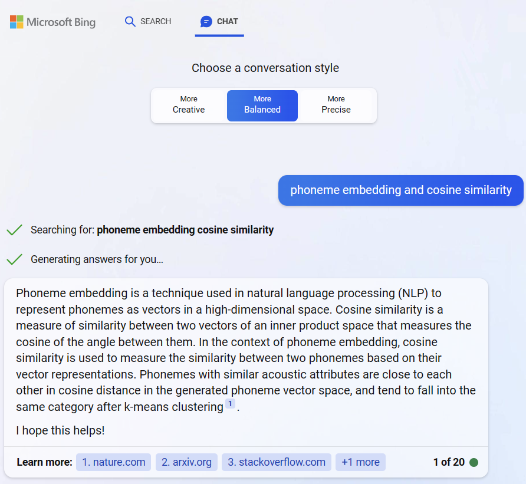

# Normalized-Uncertainty Phonetic (NUPhone) Representation

##### Version 1.0.3.523

### Introducing NUPhone

The International Phonetic Alphabet (IPA) is a highly embraced standard representation for sounds. Professional linguists often use it to provide clear phonetic representation for any language. However, when used for fuzzy matching, it can actually be too precise. While diacritics provide the extra precision for linguists, they can be considered noise in comparison logic that expects high recall on fuzzy comparisons. For that reason, when normalizing full-fidelity IPA into NUPhone, diacritics found in standard IPA can be removed.  To be clear, NUPhone is not optimized for linguists. Instead it is optimized to streamline phonetic comparison logic, phoneme-by-phoneme.

NUPhone is concerned about more than just normalization, it alsoe represents uncertainty. For example, <read> has two pronunciations. In IPA, we might represent the past and present tenses of this verb in this manner:

[rɛd] or [rid]

In NUPhone, we represent the variation (i.e. uncertainty) using a conflated expression. While we utilize IPA characters in NUPhone, our notation is in direct conflict with standard IPA. Yet, it streamlines phoneme-by-phoneme comparison logic.

Quite simply, /rɛd/ or /rid/ becomes conflated in NUPhone as:

r{ɛ|i}d

A secondary benefit of this notation is that table-driven IPA hash-lookups can be efficiently represented. Accordingly, NUPhone expressions remain intuitive. For OOV words where a table-driven lookup is a concatenation of smaller segmented lookups [segmented lookups are used to generate the whole, by composition]. Uncertainty points, where a segment-lookup yields multiple values, are easily discerned in NUPhone representation.

If a user chooses to further decorate the NUPhone example depicted above as [r{ɛ|i}d], /r{ɛ|i}d/, or even \\r{ɛ|i}d\\, we would **not** object. Quite possibly, however, others might ;-)

NUPhone is very opinionated about eliminating redundancy in expressions. We strongly discourage this type of expression for [rɛd] or [rid]:

\* {rɛd|rid}

While the above representation might be easier to generate from lookup tables, comparison logic would be more expensive. The parts that are similar among the variant phonetic representations are expected to be outside of the squiggly braces.

### Heads & Tails String-Matching

While there are numerous opportunities to pursue cross-orthography fuzzy string comparisons and search logic, this open-source effort is narrowly focused on Modern English and Early Modern English [as found in the King James Bible]. By narrowing the focus to a mostly singular language domain, the problem-space is greatly simplified. Large tech companies, like Microsoft, provide more sophisticated solutions for cross-language processing.

That said, let's look at ways to speed up similarity processing for English-language strings.

On 23 May 2023, I had this short conversation with Bing:

I was rightly impressed with her response. Given her insight, let's also consider the value proposition of using phonemes for sounds-alike searching. We will not only look for ways ways to speed up similarity processing, but we will consciencely seek a design that provides a broader spectrum of results with high fidelity.

This academic paper describes how phoneme embeddings and similarity measurements can be rolled-up into whole-token comparisons:

https://arxiv.org/pdf/2109.14796.pdf   [<u>Phonetic Word Embeddings</u>, Rahul Sharma et al]

The paper, <u>Phonetic Word Embeddings</u> by Rahul Sharma et al, serves as a great foundation upon which to build fuzzy string comparison logic. There are two prevailing paradigms for fuzzy string comparisons: string-similarity metrics, and edit-distance metrics. Ratcliff/Obershelp (R/O) pattern recognition is an example of the former; Levenshtein distance is an example of the latter. I fundamentally prefer similarity metrics over distance metrics. However, the Levenshtein algorithm is more intuitively understood, and it is less CPU-intensive, when compared with Ratcliff/Obershelp.

For whatever reason [perhaps CPU costs], Levenshtein distance seems to be the de facto standard for similarity assessment. Finding similar strings using difference metrics seems non-optimum, or just plain weird to me. Even this open-source effort by Microsoft Research favors Levenshtein:
https://github.com/Microsoft/PhoneticMatching

So given my affinity for similarity metrics over difference metrics, I am introducing the Heads & Tails (H&T) algorithm. Described herein, it can be characterized as a simplification of R/O. However, it was not conceived as a derivative of R/O (I discovered R/O, five or so years after my initial H/T implementation). Still, the similarity of H&T with R/O is notable. Under most use-cases, H&T should result in far fewer comparisons than R/O. I expect no degradation with it vis-à-vis R/O, when processing NUPhone representations of English tokens (I am less certain about other languages and orthographies). This document does not describe every difference between H&T and R/O, but it does identify some key differences.

R/O considers the longest common substring (LCS) between two strings, in order to drive comparison logic. H&T simplifies this, by only considering two LCS candidates: the start of the two strings; and the end of the two strings. That minor change dramatically simplifies remainder-processing. Moreover, it reduces the frequency of character-by-character comparisons. Meanwhile, H&T implementations become substantially less complex than R/O implementations. Simplification, in turn, makes H&T derivatives more intuitive. To be clear, Levenshtein is easier to understand than R/O. Yet, H&T and Levenshtein are on a more level playing field. While the R/O algorithm demands recursive implementations and scoring accumulators, H&T can be implemented with iterative processing and simple += scoring.

This is my first public announcement of the H&T algorithm. I originally conceived of it in 2016, while in pursuit of a Masters in Computational Linguistics at the University of Washington. During my coursework, I was performing word alignment between bitexts using H&T. Specifically, I was aligning the words of an early French translation of the bible with the words of an early English version of the bible in conjunction with machine translation to align the bitexts. Without providing the full details here, suffice it to say that I quickly understood the merit of the H&T processing concept, even though it sat dormant until now. Interestingly, the academic paper, cited above, likewise ascribes merit to word endings [H&T prefers both beginnings and endings].

In this repo, I am tweaking my original H&T algorithm to utilize NUPhone representation. There are a number freely available tabular resources for IPA and ARPAbet. These can easily be incorporated into a general-purpose English-to-NUPhone generator:

1) [The 44 Phonemes in English (dyslexia-reading-well.com)](https://www.dyslexia-reading-well.com/44-phonemes-in-english.html)
2) [ipa-dict/en_US.txt at master · open-dict-data/ipa-dict · GitHub](https://github.com/open-dict-data/ipa-dict/blob/master/data/en_US.txt)
3) [The CMU Pronouncing Dictionary](http://www.speech.cs.cmu.edu/cgi-bin/cmudict)
4) [arpabet-to-ipa/App.php at master · wwesantos/arpabet-to-ipa · GitHub](https://github.com/wwesantos/arpabet-to-ipa/blob/master/src/App.php)

H&T uses a similarity paradigm. Rolling up a similarity score for a word, based upon the similarity of its components is altogether intuitive. Even Bing [GPT-4] seems to be in full accord. Stay tuned for source code. Coding will be Rust or C++.
